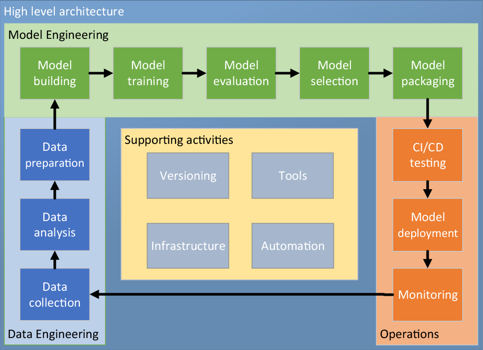

# Data Centric Cloud MLOps: Transforming your Data into Action
Switch from experimentation to production using GitData.AI's MLOps Services. Accelerate your project pace to achieve attractive return on investment.

## Why Choose GitData.AI's MLOps Services?
GitData.AI offers comprehensive MLOps solutions tailored for both public and private cloud infrastructure across the complete MLOps lifecycle. With a robust emphasis on security, scalability and agility, our services are designed to accelerate your ML projects while ensuring competitiveness and compliance with industry standards.

### Fetch Data
This involves gathering multiple datasets, verifying their accuracy, and performing necessary transformations.

### Feature Engineering
This step may need alignment of features and efficient caching strategies.

### Model Training and Testing
Requires searching for the best hyperparameters to optimize model performance.

### Model Storage
Needs careful monitoring and a phased rollout approach.

### Model Deployment
Also requires careful monitoring and staged implementation.

## GitData.AI's MLOps Cloud Service Offerings

### Automated Data Management
Data Ingestion and Integration, Data Preparation and Labelling.

### Model Development & Experimentation
Collaborative Development Environments, Experiment Tracking and Versioning.

### Model Training & Validation
Automated Machine Learning (AutoML), Distributed Training.

### Model Deployment and Scaling
Model Serving, Model Scalability.

### Continuous Integration and Continuous Development (CI/CD)
Automate ML Workflows, Enable rapid testing, integration and deployment of models.

### Monitoring and Operations
Performance monitoring, Model Retraining and Updating.

### Integration and API’s
API Management to interact with deployed models including rate limiting, logging and authentication.

### Analytics and Reporting
Comprehensive analytical dashboard and reporting tools to gain insight into the performance.

## Benefits of GitData.AI's MLOps Solution

* Rapid time to the Market

* Accelerate Productivity and Development of AI Models

* Streamlined Model Deployment

## High-level structure of the MLOps cycle

## MLOps supporting activities

## MLOps in industry 4.0
